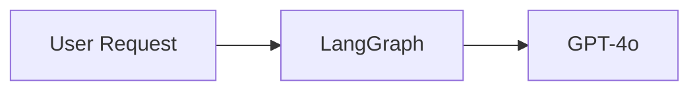

# Agentic Blog Writer — Project Reference

Everything you need to understand, explain, extend, or debug this project.

---

## Table of Contents

1. [What This Project Does](#1-what-this-project-does)
2. [Core Concepts (LangGraph Primer)](#2-core-concepts-langgraph-primer)
3. [System Architecture](#3-system-architecture)
4. [How Scripts Are Linked](#4-how-scripts-are-linked)
5. [Every Script Explained](#5-every-script-explained)
6. [The State Object (BlogState)](#6-the-state-object-blogstate)
7. [Data Flow — What Each Node Receives and Returns](#7-data-flow--what-each-node-receives-and-returns)
8. [The Parallel Topology — Why and How](#8-the-parallel-topology--why-and-how)
9. [Configuration System](#9-configuration-system)
10. [Visual Enrichment Pipeline](#10-visual-enrichment-pipeline)
11. [Medium Publishing Flow](#11-medium-publishing-flow)
12. [Output Artifacts](#12-output-artifacts)
13. [Benefits of the Current Design](#13-benefits-of-the-current-design)
14. [Drawbacks and Limitations](#14-drawbacks-and-limitations)
15. [Tech Stack — Every Dependency Explained](#15-tech-stack--every-dependency-explained)
16. [API Keys — What Each One Does](#16-api-keys--what-each-one-does)
17. [How to Add a New Node](#17-how-to-add-a-new-node)

---

## 1. What This Project Does

The user provides two things:
- A **blog title** (e.g. "Why Most AI Projects Fail Before They Start")
- A few lines of **context** (target audience, key points, tone)

The system then runs a graph of 9 AI agents that autonomously:
1. Expands the context into a detailed brief
2. Researches the web for facts, statistics, and examples
3. Analyzes what formats and hooks are trending right now
4. Builds a structured outline
5. Writes a full 800–6000 word draft
6. Edits the draft for clarity and flow
7. Generates SEO metadata (tags, keywords, meta description)
8. Injects visuals — diagrams, images, GIFs, tables, callout blocks
9. Saves the result as Markdown + HTML
10. Optionally publishes directly to Medium via browser automation

**Total time:** ~3–5 minutes. No human involved between step 1 and step 9.

---

## 2. Core Concepts (LangGraph Primer)

Before diving into the architecture, understand these three concepts:

### What is LangGraph?
LangGraph is a library for building **stateful, multi-agent workflows** as graphs. Think of it as a flowchart where each box is an AI agent and the arrows are data flows. It's built on top of LangChain.

### What is a Node?
A node is a Python function that:
- Receives the current **state** (a shared dictionary with all data so far)
- Does some work (calls an LLM, searches the web, etc.)
- Returns an **updated state** (the same dictionary with new/changed fields)

```python
def my_node(state: BlogState) -> BlogState:
    # do work
    return {**state, "new_field": result}
```

### What is the State?
The state (`BlogState`) is a **single shared dictionary** that travels through the entire graph. Every node reads from it and writes to it. It's how nodes communicate — there are no direct function calls between nodes.

### What is an Edge?
An edge tells LangGraph which node runs after which. Adding an edge from node A to node B means "run B after A finishes." Adding edges from A to both B and C means "run B and C at the same time after A finishes" — this is parallel execution.

### Fan-out and Fan-in
- **Fan-out**: One node → multiple nodes (parallel execution begins)
- **Fan-in**: Multiple nodes → one node (LangGraph waits for ALL predecessors before running the downstream node)

This is what makes the double-diamond topology work — no locks, no polling, no async code needed. LangGraph handles the synchronization automatically.

---

## 3. System Architecture

### Graph Topology — Double Diamond

```
                    START
                      │
                      ▼
            ┌─────────────────┐
            │ context_enhancer │   Expands brief
            └────────┬────────┘
                     │
             ┌───────┴───────┐     ← FAN-OUT (both start simultaneously)
             ▼               ▼
      ┌──────────┐    ┌──────────────┐
      │researcher│    │trend_analyst │   Web research + Trend analysis
      └──────────┘    └──────────────┘
             │               │
             └───────┬───────┘     ← FAN-IN (outline waits for both)
                     ▼
          ┌────────────────────┐
          │  outline_generator  │   H1/H2/H3 structure
          └──────────┬─────────┘
                     │
                     ▼
               ┌──────────┐
               │  writer   │        Full prose draft
               └─────┬────┘
                     │
             ┌───────┴───────┐     ← FAN-OUT (both start simultaneously)
             ▼               ▼
        ┌────────┐    ┌─────────────┐
        │ editor │    │seo_analyzer │   Edit prose + Generate SEO
        └────────┘    └─────────────┘
             │               │
             └───────┬───────┘     ← FAN-IN (enhancer waits for both)
                     ▼
               ┌──────────┐
               │ enhancer  │        Inject visuals
               └─────┬────┘
                     │
                     ▼
             ┌─────────────┐
             │ save_output  │        Write .md + .html to disk
             └──────┬──────┘
                    │
                   END
```

### Why Two Diamonds?

**Diamond 1 (researcher + trend_analyst):**
Both only need `title` and `context` — they have zero dependency on each other. In the old sequential version, trend_analyst would wait 22 seconds doing nothing while researcher finished. Now they run side-by-side.

**Diamond 2 (editor + seo_analyst):**
Both only need the raw `draft`. Editing prose and generating SEO keywords are completely separate tasks with no shared state. Previously SEO was bundled inside the editor node — this forced it sequential. Splitting them into two nodes unlocks parallelism.

**Net result:** ~35–40 seconds saved per run. More importantly, each node now has a **single responsibility** — editor only edits, SEO analyzer only does SEO.

---

## 4. How Scripts Are Linked

This shows exactly which file imports from which:

```
main.py
 ├── imports graph.py          → build_graph()
 ├── imports config.py         → get_blog_config()
 └── imports nodes/publisher.py (conditionally, after pipeline)

graph.py
 ├── imports state.py          → BlogState
 ├── imports nodes/context_enhancer.py
 ├── imports nodes/researcher.py
 ├── imports nodes/trend_analyst.py
 ├── imports nodes/outline_generator.py
 ├── imports nodes/writer.py
 ├── imports nodes/editor.py
 ├── imports nodes/seo_analyzer.py
 ├── imports nodes/enhancer.py
 └── imports utils/file_handler.py  → save_blog()

nodes/researcher.py
 ├── imports state.py
 └── imports tools/search.py   → get_search_tool()

nodes/trend_analyst.py
 ├── imports state.py
 └── imports tools/search.py   → get_search_tool()

nodes/context_enhancer.py
 └── imports state.py

nodes/outline_generator.py
 └── imports state.py

nodes/writer.py
 └── imports state.py

nodes/editor.py
 └── imports state.py

nodes/seo_analyzer.py
 └── imports state.py

nodes/enhancer.py
 ├── imports state.py
 └── imports mcp_server/visual_tools.py → process_blog_visuals()

nodes/publisher.py
 └── imports state.py

utils/file_handler.py
 └── imports utils/html_generator.py → generate_html()

mcp_server/server.py
 └── imports utils/html_generator.py → generate_html()

tools/search.py
 └── imports langchain_tavily        → TavilySearch

state.py
 └── (no internal imports — foundation layer)
```

### Dependency Layers (bottom = no dependencies, top = depends on everything)

```
Layer 0 (foundation):  state.py
Layer 1 (tools):       tools/search.py, utils/html_generator.py
Layer 2 (nodes):       all files in nodes/
Layer 3 (graph):       graph.py, utils/file_handler.py
Layer 4 (entry):       main.py, mcp_server/server.py, config.py
```

**Build order rule:** Always fix `state.py` first. Any change to BlogState affects every node. `graph.py` is always the last thing to touch when adding/removing nodes.

---

## 5. Every Script Explained

### `state.py`
**What it is:** The data contract for the entire pipeline.

**Why it exists:** LangGraph needs a single typed dictionary that all nodes agree on. Every node receives this dict and returns an updated version of it. Without a shared state definition, nodes couldn't communicate.

**What's in it:**
```python
class BlogState(TypedDict):
    title: str               # Blog title — set at start, never changes
    context: str             # Starts as user input, gets expanded by context_enhancer
    blog_config: dict        # User's config choices (length, tone, audience, etc.)
    research: str            # Output of researcher node
    trend_insights: str      # Output of trend_analyst node
    next_blog_suggestions: list  # 5 follow-up ideas from trend_analyst
    outline: str             # Output of outline_generator node
    draft: str               # Output of writer node
    edited_draft: str        # Output of editor node
    seo_data: dict           # Output of seo_analyzer node
    final_blog: str          # Output of enhancer node (the complete blog)
    output_file: str         # File path after save_output
    medium_url: str          # Set to "published" after Medium publishing
```

**Key insight:** Fields start as `None` and get filled in as the pipeline progresses. Each node only reads the fields it needs and only writes the field(s) it produces.

---

### `config.py`
**What it is:** Interactive CLI questionnaire that runs before the pipeline starts.

**Why it exists:** Different blog goals need different settings. A pillar content piece needs 4000+ words; a quick post needs 800. Technical posts need different tone than motivational ones. The config lets the user control this without touching any code.

**What it collects:**
| Setting | Options | Default |
|---------|---------|---------|
| Length | Short/Medium/Long/Pillar | Medium (1500–2500 words) |
| Tone | Conversational/Professional/Technical/Inspirational | Conversational |
| Audience | Beginners/Intermediate/Advanced/Mixed | Intermediate |
| Format | Deep Dive/How-To/Listicle/Hot Take/Myth-Busting/Case Study | Deep Dive |
| GIFs | 0, 1, or 2 | 2 |
| Diagrams | Yes/No | Yes |

**Output:** A `dict` stored in `state["blog_config"]`. Every node that cares about these settings reads from this dict.

**Nodes that use blog_config:** `writer` (word_range, tone, audience, format, diagrams), `enhancer` (max_gifs, diagrams), `outline_generator` (section_range, format, audience).

---

### `graph.py`
**What it is:** The wiring diagram for the entire pipeline. No business logic lives here.

**Why it exists:** Separation of concerns. Graph topology (which node runs after which) is separate from what each node actually does. To change the order of execution or add parallelism, you only edit `graph.py`.

**How it works:**
```python
graph = StateGraph(BlogState)   # Create graph with our state type

graph.add_node("researcher", researcher_node)   # Register each function as a node

graph.add_edge(START, "context_enhancer")       # First node to run
graph.add_edge("context_enhancer", "researcher") # After enhancer, run researcher
graph.add_edge("context_enhancer", "trend_analyst") # ...AND trend_analyst (parallel!)
graph.add_edge("researcher", "outline_generator")   # Fan-in starts here
graph.add_edge("trend_analyst", "outline_generator") # outline waits for BOTH

graph.compile()  # Validates the graph and returns a runnable object
```

**Important:** `graph.compile()` validates that:
- No node is unreachable
- No node is missing
- No fan-in has missing predecessors
It will raise an error at startup (not at runtime) if the graph is invalid.

---

### `main.py`
**What it is:** The entry point. The only file the user runs directly.

**What it does (in order):**
1. `validate_env()` — checks `OPENAI_API_KEY` and `TAVILY_API_KEY` are set. Exits with a clear message if not.
2. `get_input()` — collects title and context either from CLI args or interactive prompts
3. `get_blog_config()` — runs the config questionnaire (from `config.py`)
4. `build_graph()` — compiles the LangGraph graph
5. `app.stream(...)` — runs the graph and prints a progress line as each node completes
6. Prints preview, SEO tags, and next blog ideas
7. Asks if the user wants to publish to Medium

**The streaming loop:**
```python
for event in app.stream({"title": title, "context": context, "blog_config": blog_config}):
    for node_name in steps:
        if node_name in event:
            # event is {"node_name": state_snapshot}
            # print timing, capture final_state
```
`app.stream()` yields one event dict per completed node. Each event key is the node name, value is the state snapshot after that node ran.

---

### `nodes/context_enhancer.py`
**What it is:** The first node in the pipeline. Turns a vague brief into a structured creative brief.

**Why it exists:** Users often provide minimal context ("write about AI agents"). The LLM writing a blog from this produces generic content. This node asks GPT-4o to think through the audience, angles, unique value, and gaps — before any research starts. The richer context then guides every downstream node.

**Input from state:** `title`, `context`
**Output to state:** `context` (overwrites the original with the enriched version)

**Temperature:** 0.5 — creative enough to add value, focused enough to stay on topic.

---

### `nodes/researcher.py`
**What it is:** The web search node. Runs in parallel with `trend_analyst`.

**Why it exists:** LLMs have a knowledge cutoff and don't know recent statistics, current events, or niche examples. Tavily search grounds the blog in real, current information.

**What it does:**
1. Builds a search query from the title: `"{title} latest trends examples statistics 2024 2025"`
2. Calls Tavily → gets 5 web results (URLs + content snippets)
3. Passes results to GPT-4o to synthesize into structured research notes
4. Returns clean Markdown research notes

**Input from state:** `title`, `context`
**Output to state:** `research`

**Why synthesize instead of using raw results?** Raw Tavily results are noisy, duplicated, and unstructured. GPT-4o summarizes them into actionable research notes that the writer can directly use.

---

### `nodes/trend_analyst.py`
**What it is:** The trend and strategy node. Runs in parallel with `researcher`.

**Why it exists:** Knowing *what to write* is different from knowing *how to write it for maximum engagement*. This node researches what formats, hooks, and angles are currently performing well for this topic — so the blog isn't just accurate, it's written to travel.

**What it does:**
1. Two Tavily searches — one for trending topics, one for best-performing blog formats
2. Passes results to GPT-4o with a content strategist persona
3. Returns trend insights + **5 follow-up blog ideas** (parsed from `---NEXT_BLOG_IDEAS---` delimiter)

**Input from state:** `title`, `context`
**Output to state:** `trend_insights`, `next_blog_suggestions`

**Temperature:** 0.6 — highest creative freedom of the research phase, because trend identification benefits from looser pattern-matching.

---

### `nodes/outline_generator.py`
**What it is:** The architecture node. The first fan-in point — waits for both `researcher` and `trend_analyst`.

**Why it exists:** Writing directly from research produces disorganized prose. An explicit outline forces logical structure before a single word of the blog is written. The outline is the skeleton; the writer just fills in the flesh.

**What it does:** Uses research notes + trend insights to generate an H1/H2/H3 outline with a 1–2 sentence description per section. The number of sections comes from `blog_config["section_range"]`.

**Input from state:** `title`, `context`, `research`, `trend_insights`, `blog_config`
**Output to state:** `outline`

---

### `nodes/writer.py`
**What it is:** The main writing node.

**Why it exists:** GPT-4o with the right persona and all the context (outline, research, trends) produces significantly better prose than a single "write a blog about X" prompt. This node is the most expensive in tokens but produces the bulk of the final content.

**What it does:** Writes the full draft following the outline, using research facts, matching the trending format, respecting tone/audience/length from config.

**Persona it adopts:** Influencer-style writer (Ali Abdaal, Lenny Rachitsky style) — short sentences, direct address, provocative subheadings, concrete examples.

**Input from state:** `title`, `context`, `research`, `trend_insights`, `outline`, `blog_config`
**Output to state:** `draft`

**Temperature:** 0.7 — highest of all nodes. Writing benefits from creativity and variation.

---

### `nodes/editor.py`
**What it is:** The prose editing node. Runs in parallel with `seo_analyzer`.

**What it does:** A focused editing pass — clarity, flow, tone, engagement. Does NOT touch SEO (that's `seo_analyzer`'s job now). Flags unsupported factual claims with `[?]`.

**Input from state:** `draft`
**Output to state:** `edited_draft`

**Temperature:** 0.3 — low temperature for consistent, conservative edits. You don't want the editor rewriting the blog creatively; you want it to improve what's already there.

**Before vs. After the refactor:** Previously this node did BOTH editing AND SEO generation in one prompt, returning them split by a `---SEO_DATA---` delimiter. Now it only edits. This made the second parallel diamond possible and gives each node a single clear responsibility.

---

### `nodes/seo_analyzer.py`
**What it is:** The SEO metadata node. Runs in parallel with `editor`. New node added during the parallel refactor.

**Why it was split out:** SEO generation doesn't need the *edited* draft — it only needs the topic and content, which are fully present in the raw `draft`. Running it in parallel with `editor` saves the time that SEO generation used to add to the editor's response time.

**What it generates:**
- `meta_description` — 150–160 character summary (for Google search snippets)
- `focus_keyword` — the one primary keyword the post targets
- `secondary_keywords` — 3–5 supporting keywords
- `tags` — 5–8 lowercase hyphenated Medium tags

**Input from state:** `title`, `draft`
**Output to state:** `seo_data`

**Temperature:** 0.2 — lowest of all nodes. SEO output must be deterministic JSON, not creative.

**Output format:** Strict JSON. The node strips markdown fences and retries parsing if needed.

---

### `nodes/enhancer.py`
**What it is:** The visual injection node. The second fan-in point — waits for both `editor` and `seo_analyzer`.

**Why it exists:** Plain text blogs don't perform as well visually. Adding diagrams, images, and GIFs makes them more engaging. But generating visuals requires knowing the final structure — which is why this runs last.

**What it does:**
1. Sends `edited_draft` to GPT-4o with a "visual content specialist" persona
2. GPT-4o inserts visual placeholders into the text:
   - ` ```mermaid ... ``` ` blocks for diagrams
   - `<!-- 📸 Image: description -->` comments for stock photos
   - `<!-- 🎭 GIF: emotion -->` comments for GIFs
3. Calls `process_blog_visuals()` from `mcp_server/visual_tools.py` to resolve all placeholders into actual images/URLs
4. Appends the SEO footer table at the end

**Input from state:** `edited_draft`, `seo_data`, `blog_config`
**Output to state:** `final_blog`

---

### `nodes/publisher.py`
**What it is:** The Medium publishing node. Only runs if the user types `y` at the final prompt.

**Why it exists:** Medium's public API was disabled for new integrations in 2023. The only way to automate publishing without copy-pasting is browser automation.

**How it works:**
1. Launches Chrome using `undetected-chromedriver` (bypasses Cloudflare/bot detection)
2. Uses a persistent Chrome profile at `~/.medium_uc_profile` — login is saved after the first run
3. Navigates to `medium.com/new-story`
4. Types the title into the title field
5. Injects the blog content as rich HTML via a simulated `ClipboardEvent` — this goes through Medium's Quill editor paste handler, which converts HTML into properly formatted text, headings, and links
6. Waits for user to manually review, add tags, and click Publish

**Why `ClipboardEvent` instead of typing?** Medium's editor is Quill-based. Typing text loses all formatting. `navigator.clipboard.write()` is blocked by browser permissions. Simulating a paste event with `text/html` data is the only reliable way to get rich formatting into Quill without using the real clipboard.

**Input from state:** `title`, `final_blog`, `seo_data`
**Output to state:** `medium_url` (set to `"published"`)

---

### `tools/search.py`
**What it is:** A one-function factory for the Tavily search tool.

**Why it exists:** Two nodes use Tavily (`researcher` and `trend_analyst`). Having one place that creates the tool means changing Tavily configuration (max results, search depth) only requires editing one file.

**What it returns:** A `TavilySearch` instance — callable with a query string, returns a list of result dicts (or a string if the API returns raw text).

---

### `utils/file_handler.py`
**What it is:** File saving utility.

**What it does:**
1. Creates `output/` directory if it doesn't exist
2. Sanitizes the title (removes special chars, replaces spaces with underscores, caps at 60 chars)
3. Appends a `YYYYMMDD_HHMMSS` timestamp (prevents overwriting previous runs on the same topic)
4. Writes the Markdown file
5. Calls `html_generator.generate_html()` to produce the `.html` preview file

**Why a separate utility instead of doing this in `graph.py`?** File I/O is not graph logic. Keeping it in `utils/` makes it reusable — `mcp_server/server.py` also calls `generate_html` independently.

---

### `utils/html_generator.py`
**What it is:** Markdown → styled HTML converter.

**What it produces:** A self-contained `.html` file with:
- All CSS inline (no external stylesheet dependency)
- Medium-style serif typography
- Responsive layout
- Click-to-zoom image lightbox (JS)
- GIF badge overlay (JS)
- Syntax highlighting via CDN (highlight.js)
- Mermaid fallback rendering via CDN

**Key function — `_fix_image_paths()`:** Converts relative image paths (e.g. `output/visuals/image_1.jpg`) to absolute `file://` URLs so they load when the HTML file is opened in a browser. Uses `Path.cwd()` as the base — important: always run from the project root.

---

### `mcp_server/visual_tools.py`
**What it is:** All image/diagram/GIF fetching logic. Used by `enhancer.py` at runtime.

**Why it's in `mcp_server/` instead of `utils/`?** This module is also exposed as MCP tools for Claude Code integration. The location reflects dual usage, not just the blog pipeline.

**Three main functions:**

`render_mermaid(diagram_code, filename)` — encodes Mermaid diagram code in base64, fetches a PNG from `mermaid.ink` (free, no auth), saves to `output/visuals/`.

`fetch_stock_image(query, filename)` — tries Unsplash → Pexels → Lorem Picsum in priority order. Returns the remote CDN URL (not local path) so it works in both HTML preview and Medium's editor.

`fetch_gif(query)` — tries Giphy API. Falls back to a curated dict of 15 emotionally-relevant GIFs if no API key is set. The fallback covers: "mind blown", "excited", "confused", "this is fine", "celebrate", "facepalm", "coding", "ai", "nailed it", "mic drop", and more.

`process_blog_visuals(blog_content)` — the orchestrator called by `enhancer.py`. Runs three regex passes over the blog text to find and replace all mermaid blocks, image comments, and GIF comments in one pass.

---

### `mcp_server/server.py`
**What it is:** An MCP (Model Context Protocol) server that exposes blog tools to Claude Code.

**Why it exists:** Allows Claude Code (this AI) to directly call tools like `render_mermaid` and `html_preview` during conversations, without running the full pipeline.

**Exposed tools:** `render_mermaid`, `fetch_stock_image`, `generate_ai_image`, `fetch_gif`, `render_diagram`, `html_preview`.

**Not part of the main pipeline** — this is a developer tool for interactive use.

---

## 6. The State Object (BlogState)

Every node receives a complete `BlogState` dict and returns an updated version. Here is each field, when it gets set, and who reads it:

| Field | Type | Set by | Read by | Notes |
|-------|------|--------|---------|-------|
| `title` | str | user input (main.py) | all nodes | Never modified after input |
| `context` | str | user input → **overwritten** by context_enhancer | all nodes | Gets richer at step 1 |
| `blog_config` | dict | config.py via main.py | writer, editor, outline_generator, enhancer | Contains length, tone, audience, format, max_gifs, diagrams |
| `research` | str | researcher | outline_generator, writer | Structured Markdown research notes |
| `trend_insights` | str | trend_analyst | outline_generator, writer | Viral format recommendations |
| `next_blog_suggestions` | list | trend_analyst | main.py (display only) | 5 follow-up ideas, shown at end |
| `outline` | str | outline_generator | writer | H1/H2/H3 skeleton |
| `draft` | str | writer | editor, seo_analyzer | Raw first draft |
| `edited_draft` | str | editor | enhancer | Polished prose |
| `seo_data` | dict | seo_analyzer | enhancer, publisher, main.py | JSON: meta_description, tags, focus_keyword, secondary_keywords |
| `final_blog` | str | enhancer | save_output, publisher, main.py | Complete blog with visuals |
| `output_file` | str | save_output (in graph.py) | main.py (display only) | Path to saved .md file |
| `medium_url` | str | publisher | (display) | Set to "published" after Medium |

---

## 7. Data Flow — What Each Node Receives and Returns

```
main.py injects:
  → title, context, blog_config

context_enhancer
  reads:  title, context
  writes: context  (enriched)

researcher  [PARALLEL]        trend_analyst  [PARALLEL]
  reads:  title, context        reads:  title, context
  writes: research              writes: trend_insights
                                        next_blog_suggestions

outline_generator  [FAN-IN — waits for both above]
  reads:  title, context, research, trend_insights, blog_config
  writes: outline

writer
  reads:  title, context, research, trend_insights, outline, blog_config
  writes: draft

editor  [PARALLEL]            seo_analyzer  [PARALLEL]
  reads:  draft                 reads:  title, draft
  writes: edited_draft          writes: seo_data

enhancer  [FAN-IN — waits for both above]
  reads:  edited_draft, seo_data, blog_config
  writes: final_blog

save_output
  reads:  title, final_blog
  writes: output_file

publisher (optional, outside graph)
  reads:  title, final_blog, seo_data
  writes: medium_url
```

---

## 8. The Parallel Topology — Why and How

### Why parallel?

In a sequential pipeline:
```
researcher (22s) → trend_analyst (18s) → ...   total: 40s for just these two
```

In parallel:
```
researcher  (22s)
                  ↘
                    → outline_generator starts at ~22s
                  ↗
trend_analyst (18s)
```
Both finish in ~22s (the longer one). Saves ~18s in the first diamond.

Same logic for the second diamond — editor and SEO analyzer both start from `draft` simultaneously. ~15–20s saved.

**Total savings: ~35–40 seconds per run.**

### How LangGraph implements this

When you add two `add_edge` calls from the same source node:
```python
graph.add_edge("context_enhancer", "researcher")
graph.add_edge("context_enhancer", "trend_analyst")
```
LangGraph interprets this as: "after `context_enhancer` finishes, start `researcher` AND `trend_analyst` at the same time."

When you add two `add_edge` calls to the same destination node:
```python
graph.add_edge("researcher", "outline_generator")
graph.add_edge("trend_analyst", "outline_generator")
```
LangGraph interprets this as: "only start `outline_generator` once BOTH `researcher` AND `trend_analyst` have finished."

LangGraph tracks which predecessor nodes have completed and automatically holds downstream nodes until all their inputs are ready. No threading code, no locks, no asyncio — the graph engine handles it.

### State merging in parallel branches

When two parallel nodes both complete, they each return an updated state dict. LangGraph merges these updates:
- `researcher` returns `{...state, "research": "..."}` — adds `research` key
- `trend_analyst` returns `{...state, "trend_insights": "...", "next_blog_suggestions": [...]}` — adds those keys
- LangGraph merges: the final state has all original keys + `research` + `trend_insights` + `next_blog_suggestions`

This works cleanly because the two parallel branches write to **different keys**. If two parallel nodes ever wrote to the same key, the last one to complete would win (non-deterministic). This is why each node in a parallel branch must have a clearly distinct output field.

---

## 9. Configuration System

`config.py` runs before the pipeline. It presents interactive menus and returns a `blog_config` dict injected into the state at startup.

```python
blog_config = {
    "word_range": "1500–2500",        # from LENGTH_OPTIONS
    "section_range": "5–8",           # from LENGTH_OPTIONS
    "tone": "Conversational / Influencer style",
    "audience": "Intermediate",
    "format": "Deep Dive",
    "max_gifs": 2,
    "diagrams": True,
}
```

Each setting gets passed into the relevant node's system prompt as instructions. For example, `writer.py` includes:
```
Target word count: {word_range} words.
Tone: {tone}.
Target audience: {audience}.
Blog format: {fmt}.
```

This means you can run the same title/context multiple times with different configs and get completely different blogs — a beginner-friendly how-to vs. a technical deep dive, for instance.

**Bypass in CLI mode:** If title and context are passed as CLI args, the config prompts still appear. Press Enter on all of them to use defaults.

---

## 10. Visual Enrichment Pipeline

The enhancer node uses a two-step process:

### Step 1 — LLM inserts placeholders
GPT-4o reads the edited draft and inserts visual placeholder tags into the Markdown:

```markdown
<!-- 📸 Image: developer staring at multiple monitors late at night -->

Some prose...



More prose...

<!-- 🎭 GIF: mind blown -->
```

### Step 2 — `process_blog_visuals()` resolves placeholders
Three regex passes over the text:

1. **Mermaid blocks** → `render_mermaid()` → base64-encodes the diagram code → fetches PNG from `mermaid.ink` → saves to `output/visuals/diagram_N.png` → replaces block with ``

2. **Image comments** → `fetch_stock_image()` → tries Unsplash (50/hour free) → tries Pexels (200/hour free) → falls back to Lorem Picsum (no auth) → returns remote CDN URL → replaces comment with ``

3. **GIF comments** → `fetch_gif()` → tries Giphy API → falls back to curated dict → returns GIF URL → replaces comment with ``

All failures are silent — if any image/diagram fetch fails, the original placeholder text is kept. The blog always generates even if visuals fail.

---

## 11. Medium Publishing Flow

```
user types "y"
     │
     ▼
publisher.py runs
     │
     ▼
undetected-chromedriver launches Chrome
with persistent profile at ~/.medium_uc_profile
     │
     ├─── First time only:
     │    Chrome opens medium.com/new-story
     │    → redirects to login (not authenticated yet)
     │    → user logs in manually in browser
     │    → user presses Enter in terminal
     │    → session saved to profile
     │
     └─── Subsequent times:
          Chrome opens medium.com/new-story directly
          → already authenticated, editor loads
          → user presses Enter when editor is ready
     │
     ▼
publisher.py finds the editor element ([contenteditable])
Types title into title field
Presses Enter to move to body
     │
     ▼
_md_to_html() converts blog Markdown → HTML
     │
     ▼
_PASTE_JS executes:
  - Creates a DataTransfer object
  - Sets text/html data to the blog HTML
  - Dispatches a ClipboardEvent("paste") on the editor
  - Medium's Quill editor receives the paste event
  - Quill converts HTML → properly formatted rich text
     │
     ▼
User manually: reviews content, adds tags, clicks Publish
```

**Why `undetected-chromedriver`?** Standard Selenium is detected by Cloudflare (Medium uses it). `undetected-chromedriver` patches the Chrome binary to remove automation fingerprints, making it indistinguishable from a real user's browser.

**Why simulate a paste event instead of typing?** Typing text via `send_keys()` sends characters one at a time — all formatting is lost. Simulating a paste event with `text/html` data is how real users paste formatted content from Word/Notion into Medium. Quill's paste handler processes the HTML and preserves headings, bold, links, etc.

---

## 12. Output Artifacts

Every successful run produces two files in `output/`:

### `<title>_<timestamp>.md`
The complete blog in Markdown format. Contains:
- Full prose (heading hierarchy, paragraphs, lists)
- Mermaid diagram blocks (may be rendered as PNGs — if so, ``)
- Stock images as remote URL links
- GIF links
- Comparison tables
- Callout blockquotes
- SEO metadata table at the bottom

### `<title>_<timestamp>.html`
Self-contained HTML file generated from the Markdown. Open in any browser. Contains:
- All CSS inline — works offline, no external dependencies except CDN links for hljs/mermaid
- Images load from remote CDN URLs (Unsplash/Pexels/Picsum)
- Local diagram PNGs load from absolute `file://` paths
- Lightbox for click-to-zoom images
- GIF badge overlays
- Syntax-highlighted code blocks
- Mermaid rendering fallback (any remaining mermaid blocks render client-side)

### `output/visuals/`
Directory where Mermaid diagram PNGs are saved during the enhancer phase. Referenced by both the `.md` and `.html` files.

---

## 13. Benefits of the Current Design

### Parallel execution saves real time
The two parallel diamonds save ~35–40 seconds per run with no extra complexity — LangGraph handles the concurrency. More agents could be parallelized in future iterations using the same pattern.

### Single responsibility per node
Each node does exactly one thing. `editor` only edits. `seo_analyzer` only does SEO. `researcher` only researches. This makes each node independently testable, replaceable, and improvable without touching others.

### State as the single source of truth
All data flows through one typed `BlogState` dict. There are no global variables, no class attributes, no inter-node direct function calls. If a node needs data, it reads from state. If it produces data, it writes to state. This is easy to debug — at any point in the pipeline you can inspect the full state and know exactly what every node has access to.

### Fail at startup, not at runtime
The graph validates at compile time (`graph.compile()`). Missing nodes, broken edges, and type mismatches surface before any LLM calls are made. You don't discover a broken graph 3 minutes into a run.

### Graceful visual fallbacks
No Unsplash key → Picsum. No Giphy key → curated GIFs. Mermaid render fails → original code block kept. The pipeline always completes even when external APIs are unavailable.

### Configurable output
One title + context can produce 6 different blog formats × 4 tones × 4 audience levels × 4 lengths = 384 distinct configurations. The same system writes beginner tutorials and expert deep dives.

### Browser-based Medium publishing
Works around Medium's API restriction. Login is saved after the first run — every subsequent publish requires only one Enter keypress.

---

## 14. Drawbacks and Limitations

### Sequential bottlenecks remain
Three nodes — `outline_generator`, `writer`, and `enhancer` — cannot be parallelized because they depend on the completed output of the previous stage. `writer` is the slowest single node (~35s for a medium post). There's no way to speed it up without changing the architecture (e.g., parallel section writing).

### No retry logic
If any LLM call fails (network error, API rate limit, timeout), the entire pipeline fails. There's no checkpoint/resume or per-node retry. A 4-minute pipeline can fail at minute 3 and need to restart from scratch.

### Cost per run
Every run makes ~9 GPT-4o API calls consuming ~29K tokens total. At ~$0.09–0.16 per run, running it 100 times a month costs ~$10–16. Not expensive, but not free.

### Medium editor fragility
The ClipboardEvent paste approach works but is browser/Medium-version dependent. If Medium updates their Quill implementation, the paste injection could break silently. The manual confirmation step (`input("Press Enter when editor is ready")`) mitigates this — the user can catch a broken paste before trying to publish.

### No streaming output
The blog content is only shown after all 9 nodes complete. There's no way to preview the outline or draft mid-pipeline without modifying the code.

### Mermaid diagram quality
AI-generated Mermaid diagrams occasionally have syntax errors. The system silently keeps the raw code block when render fails — the user needs to manually fix these in the output file.

### No content memory across runs
Each run starts fresh. There's no awareness of blogs already written, no consistency checker across a series, no "don't repeat examples from last week." Each run is fully isolated.

### Image context gap
Stock photos are fetched based on a text description generated by the LLM. Unsplash/Pexels search quality varies — the returned image may not perfectly match the description. No human review step before the image appears in the output.

---

## 15. Tech Stack — Every Dependency Explained

| Package | What it is | Why this project needs it |
|---------|-----------|--------------------------|
| `langgraph` | Graph-based agent orchestration library | Defines the pipeline topology (nodes, edges, fan-out, fan-in), handles state passing and parallel execution |
| `langchain-openai` | LangChain's OpenAI integration | Provides `ChatOpenAI` — the uniform interface used to call GPT-4o in every node |
| `langchain-tavily` | LangChain's Tavily integration | Provides `TavilySearch` tool used by researcher and trend_analyst nodes |
| `tavily-python` | Tavily's Python client library | Required by `langchain-tavily` under the hood |
| `openai` | OpenAI Python SDK | Used directly in `generate_ai_image()` in visual_tools.py for DALL-E 3 image generation |
| `python-dotenv` | `.env` file loader | Loads `OPENAI_API_KEY`, `TAVILY_API_KEY`, etc. into `os.environ` at startup |
| `markdown` | Python Markdown parser | Converts Markdown text to HTML in `html_generator.py` and `publisher.py` |
| `httpx` | Modern async-capable HTTP client | Fetches images from Unsplash/Pexels/Picsum and diagrams from mermaid.ink in visual_tools.py |
| `undetected-chromedriver` | Bot-detection-resistant Selenium Chrome driver | Bypasses Cloudflare detection when automating Medium |
| `selenium` | Browser automation library | Used by publisher.py to interact with Medium's editor (click, type, inject JS) |
| `fastmcp` | Fast MCP server framework | Powers `mcp_server/server.py` — exposes tools to Claude Code |

---

## 16. API Keys — What Each One Does

| Key | Service | Used for | Free tier | Required? |
|-----|---------|---------|-----------|-----------|
| `OPENAI_API_KEY` | OpenAI | All 9 LLM calls (GPT-4o) | Pay-per-use | **Yes** |
| `TAVILY_API_KEY` | Tavily | Web search in researcher + trend_analyst | 1,000 req/month | **Yes** |
| `UNSPLASH_ACCESS_KEY` | Unsplash | Stock photos — most contextually accurate | 50 req/hour | No (Picsum fallback) |
| `PEXELS_API_KEY` | Pexels | Stock photos — second priority | 200 req/hour | No (Picsum fallback) |
| `GIPHY_API_KEY` | Giphy | Animated GIFs | Free dev key | No (curated fallback) |

**What happens with no optional keys:** The pipeline still runs to completion. Images become generic Picsum photos (deterministic seeds — same topic always gets the same photo). GIFs come from a curated 15-GIF set covering common emotional moments. No errors, no warnings — just less contextually accurate visuals.

---

## 17. How to Add a New Node

Step-by-step example: adding a **Fact Checker** node that runs after the writer and flags potentially incorrect claims.

### Step 1 — Add the output field to state.py
```python
class BlogState(TypedDict):
    ...
    fact_check_report: Optional[str]   # ← add this
```

### Step 2 — Create nodes/fact_checker.py
```python
from langchain_openai import ChatOpenAI
from langchain_core.messages import SystemMessage, HumanMessage
from state import BlogState

def fact_checker_node(state: BlogState) -> BlogState:
    llm = ChatOpenAI(model="gpt-4o", temperature=0.2)
    messages = [
        SystemMessage(content="You are a fact checker. Identify any specific claims in this blog that could be factually incorrect. List each claim and your confidence it's accurate."),
        HumanMessage(content=state["draft"]),
    ]
    response = llm.invoke(messages)
    return {**state, "fact_check_report": response.content}
```

### Step 3 — Wire it into graph.py
Decide where it fits in the graph. If it runs in parallel with `editor` and `seo_analyzer` (all three only need `draft`):

```python
from nodes.fact_checker import fact_checker_node

graph.add_node("fact_checker", fact_checker_node)

# Add to the third parallel leg
graph.add_edge("writer", "fact_checker")
graph.add_edge("fact_checker", "enhancer")
```

Now `enhancer` waits for `editor`, `seo_analyzer`, AND `fact_checker` before running — a triple fan-in.

### Step 4 — Update main.py
```python
steps = [..., "fact_checker", ...]
step_labels = {..., "fact_checker": "🔎 Fact checking   ◀ parallel", ...}
```

### Step 5 — Use the new field in enhancer (optional)
If the enhancer should use the fact check report, read `state.get("fact_check_report", "")` inside `enhancer.py`.

That's it. Four files touched. LangGraph handles the rest.
