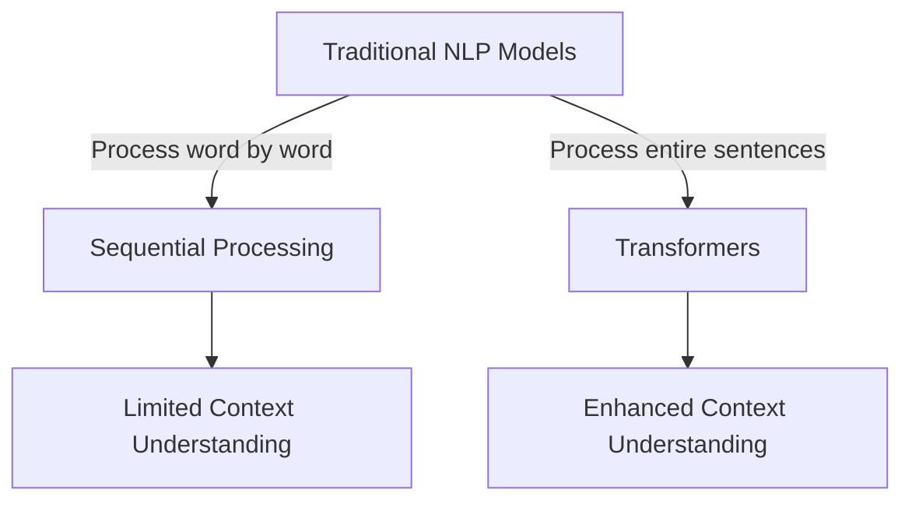
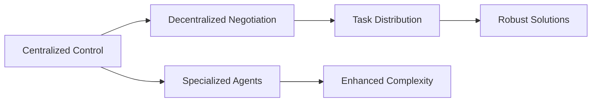

# From Transformers to Multi-Agent Architectures: The Evolution of Large Language Models

## Introduction: The AI Revolution You Can't Afford to Ignore

Imagine AI not just chatting with you, but solving complex problems on its own. This isn't science fiction—it's the era of multi-agent architectures. As AI becomes more integral to our lives and businesses, understanding its evolution from simple chatbots to sophisticated systems is essential.

This blog is your guide through the transformative journey of Large Language Models (LLMs) beyond transformers, highlighting the rise of agentic AI and multi-agent architectures. Let's explore how we got here and where we're heading.

## The Birth of Transformers: A Game-Changer in NLP

In 2017, a seismic shift in natural language processing (NLP) came with transformers. Unlike earlier models, transformers processed entire sentences simultaneously, not just word by word. This wasn't a tweak—it was a revolution.

Transformers laid the groundwork for modern LLMs, making them more efficient and powerful. Machines could now understand context and nuance in ways that were once science fiction.

## Beyond Transformers: The Rise of Generative Pre-trained Transformers (GPTs)

Generative Pre-trained Transformers, or GPTs, took the innovations of transformers further. Pre-trained to predict the next word in a sequence, GPTs have significantly advanced conversational AI.

GPTs have transformed AI's ability to generate, summarize, and analyze text with uncanny accuracy. The leap from basic chatbots to sophisticated conversational AI is groundbreaking, with applications in customer service and creative writing.

## Open-Weight Models and Democratization of AI

The real magic began with open-weight models like BLOOM and LLaMA, gaining traction since 2022. These models, with fewer restrictions, have made powerful AI tools more accessible, spurring innovation.

> **💡 Key Insight:** Open-weight models are democratizing AI, enabling innovation by reducing barriers and inviting more players into AI development.

## The Dawn of Agentic AI: Autonomy in Action

Welcome to Agentic AI—systems that autonomously plan, execute, and adapt to achieve complex goals. We're moving beyond simple response generation to AI that thinks and acts with minimal human intervention.

> **📌 Note:** The AI agents market grew from $5.4 billion in 2024 to $7.6 billion in 2025, with projections reaching $50 billion by 2030.

**Scroll-stopper:** By 2029, 80% of customer support issues will be handled by AI agents, according to Gartner.

## Architectural Shifts: Embracing Multi-Agent Systems

What are multi-agent architectures? Imagine distributing tasks across specialized agents, each tackling specific problems, enhancing the system's complexity and robustness.

These architectures range from centralized control to decentralized negotiation. It's like having a team of experts, each handling part of a project, coordinating efficiently to solve complex problems. The implications for industries like logistics, healthcare, and finance are massive, enabling faster and more adaptive solutions.

## Real-World Applications and Emerging Trends

Consider real-world examples like Meta's Llama 4, released in 2025, featuring multimodal capabilities and extended context. It faces competition from international models like Alibaba's Qwen.

| Model      | Release Year | Features                          | Competitors          |
|------------|--------------|-----------------------------------|----------------------|
| Llama 4    | 2025         | Multimodal capabilities, extended context | Alibaba's Qwen       |
| Mistral 3  | 2025         | High performance, cost-effective  | Various              |

Mistral AI's Mistral 3 model offers high performance at a fraction of the cost. These advancements aren't just about power; they're about making cutting-edge AI accessible and affordable, setting a trend towards cost-effective, high-performance LLMs.

## Challenges and Ethical Considerations in LLM Development

Despite the excitement, challenges remain. Bias and reliability are major concerns—LLM outputs can be unreliable due to biased training data. Ensuring accuracy and fairness is an ongoing battle.

> **⚠️ Warning:** The risk of "LLM grooming," where AI outputs are manipulated for disinformation, can't be ignored. Effective safety measures are tough to implement but necessary to protect against misuse.

## Expert Insights and Future Projections

Gartner's prediction that AI will handle 80% of customer support issues by 2029 highlights a growing reliance on AI. But what does this mean for the future?

The integration of reasoning and agentic capabilities in LLMs is expected to continue, driving further advancements in AI autonomy and functionality. We're on the brink of AI systems that not only perform tasks but also reason through them, opening new frontiers in automation and decision-making.

## Conclusion: Navigating the Future of AI

We've moved from basic chatbots to sophisticated multi-agent architectures, witnessing significant advancements post-transformers. The integration of agentic capabilities and multi-agent systems marks a new era in AI, full of promise and challenges.

> **💡 Key Insight:** Staying informed and engaged with AI advancements is crucial. Harnessing their potential responsibly and effectively could redefine industries, economies, and our daily lives. The AI revolution is here—are you ready to be part of it?

---

## 📊 SEO Metadata

| Field | Value |
|-------|-------|
| **Meta Description** | Explore the evolution of Large Language Models from transformers to multi-agent architectures, highlighting AI's transformative journey. |
| **Focus Keyword** | large language models |
| **Secondary Keywords** | transformers, multi-agent architectures, generative pre-trained transformers, agentic AI |
| **Tags** | `ai`, `large-language-models`, `transformers`, `multi-agent-systems`, `generative-ai` |
